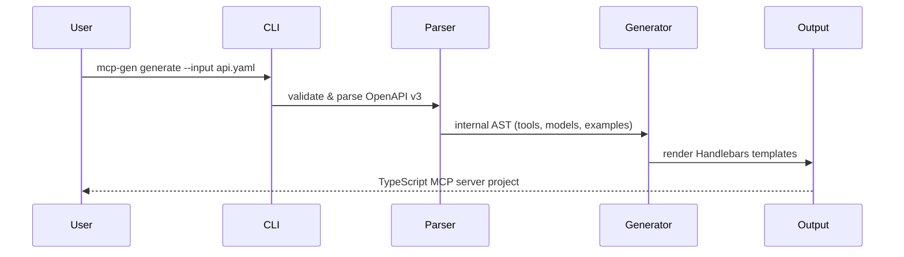

# openapi-to-mcp

> Turn any OpenAPI spec into a ready-to-run MCP server in seconds.

```bash
mcp-gen generate --input openapi.json --out ./my-server
```

No boilerplate. No manual wiring. Just a working [Model Context Protocol](https://modelcontextprotocol.io) server with every endpoint mapped to a tool, example responses included.

---

## Why

MCP became the standard way to expose APIs to AI agents in 2025/26. Writing MCP servers by hand means repeating the same scaffolding for every project — parsing specs, registering tools, handling schemas. `openapi-to-mcp` eliminates that entirely.

You bring the spec. The CLI brings the server.

---

## How it works



Each `path + method` in your spec becomes an MCP **tool** with:
- Typed input schema derived from parameters and request body
- Example response from the spec (or a `NotImplemented` stub)
- Full JSDoc comments

---

## Requirements

- Node.js 20+
- npm 9+

---

## Installation

```bash
# Clone and install
git clone https://github.com/your-username/openapi-to-mcp.git
cd openapi-to-mcp
npm install
npm run build
```

> npm publish coming soon — `npm install -g mcp-gen` will work once released.

---

## Usage

### Validate a spec

```bash
node dist/cli/index.js validate --input ./api/openapi.json
```

```
✔ Spec is valid

  Tools: 12  Models: 6  Base URL: https://api.example.com
```

### Generate a server

```bash
node dist/cli/index.js generate \
  --input ./api/openapi.json \
  --out ./generated/my-server
```

```
✔ Generation complete

  ✓ 7 files created

    /generated/my-server/src/server.ts
    /generated/my-server/src/models.ts
    /generated/my-server/package.json
    /generated/my-server/tsconfig.json
    /generated/my-server/README.md
    /generated/my-server/Dockerfile
    /generated/my-server/.github/workflows/ci.yml
```

### Run the generated server

```bash
cd generated/my-server
npm install
npm run build
npm start
```

### Accepts URLs too

```bash
node dist/cli/index.js generate \
  --input https://petstore3.swagger.io/api/v3/openapi.json \
  --out ./petstore-mcp
```

---

## CLI Reference

| Flag | Description | Default |
|------|-------------|---------|
| `--input`, `-i` | Path or URL to the OpenAPI spec (JSON or YAML) | required |
| `--out`, `-o` | Output directory for the generated project | `./mcp-server` |
| `--lang`, `-l` | Target language: `typescript` | `typescript` |
| `--force`, `-f` | Overwrite existing files without prompting | `false` |
| `--name` | Override the server name | derived from spec title |
| `--version` | Override the server version | derived from spec |

---

## Generated project structure

```
my-server/
├── src/
│   ├── server.ts        # MCP server — tool definitions + handlers
│   └── models.ts        # TypeScript interfaces from OpenAPI schemas
├── .github/
│   └── workflows/
│       └── ci.yml       # GitHub Actions: build + test
├── Dockerfile           # Multi-stage production image
├── package.json
├── tsconfig.json
└── README.md            # Usage guide for the generated server
```

---

## Connect to Claude Desktop

Add the generated server to your `claude_desktop_config.json`:

```json
{
  "mcpServers": {
    "my-server": {
      "command": "node",
      "args": ["/absolute/path/to/my-server/dist/server.js"]
    }
  }
}
```

Restart Claude Desktop. Your API tools will appear automatically.

---

## Implement handlers

The generated `src/server.ts` returns spec examples by default. Replace stubs with real logic:

```typescript
case "get_users_id": {
  const user = await db.users.findById(args.id);
  return {
    content: [{ type: "text", text: JSON.stringify(user) }],
  };
}
```

Tools without an example response in the spec will throw `NotImplemented` — the CLI warns you which ones upfront.

---

## Development

```bash
# Run tests
npm test

# Type-check only
npx tsc --noEmit

# Try the example spec
node dist/cli/index.js generate --input examples/petstore.json --out /tmp/petstore --force
```

---

## Roadmap

| Week | Status | Scope |
|------|--------|-------|
| 0–1 | ✅ Done | CLI, OpenAPI v3 parser, TypeScript generator, 7-file scaffold |
| 2 | 🔜 Next | Python/FastAPI target, YAML input support |
| 3 | Planned | Dockerfile polish, integration tests, CI template improvements |
| 4 | Planned | Interactive CLI mode, npm/pip publish |
| 5 | Planned | Incremental generation — preserve custom code blocks |
| 6 | Planned | Release candidate, Product Hunt launch |

---

## Known limitations

- OpenAPI v2 (Swagger) is not supported — v3.x only
- `oneOf` / `anyOf` / `discriminator` schemas are partially handled (MVP)
- Python target is not yet implemented
- `copy-templates` script uses `cp` — on Windows, change to `xcopy` in `package.json`

---

## License

MIT © 2026