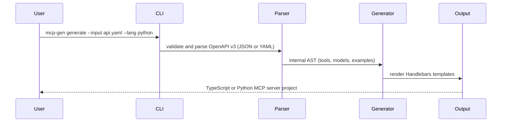

# MCP-Generator

Generate MCP servers from OpenAPI specs.

`mcp-gen` turns an OpenAPI v3 spec into an MCP server in TypeScript or Python. It maps each route to a tool and keeps custom code when you regenerate.

## Quick start

```bash
npm install
npm run build
```

Generate a server from a local spec:

```bash
mcp-gen generate -i examples/petstore.json -l typescript -o ./my-server
```

Validate a spec without generating files:

```bash
mcp-gen validate -i examples/petstore.yaml
```

Run the interactive CLI if you prefer prompts:

```bash
npm run dev
```

## What it does



Each route becomes an MCP tool with:

- typed input from parameters and request bodies
- example responses from the spec
- optional incremental code preservation

## Requirements

- Node.js 20+
- npm 9+

## Installation

```bash
git clone https://github.com/ChristopherDond/MCP-Generator.git
cd MCP-Generator
npm install
npm run build
```

## CLI

### Commands

- `mcp-gen generate` or `mcp-gen g` creates a server from a spec.
- `mcp-gen validate` or `mcp-gen v` checks a spec without generating files.
- `mcp-gen init` downloads a known public spec and can generate a project.
- `mcp-gen watch` watches a file or URL and regenerates on changes.

### Generate

```bash
mcp-gen generate -i ./api/openapi.yaml -l typescript -o ./my-server
mcp-gen generate -i ./api/openapi.yaml -l python -o ./my-server
```

Useful flags:

- `--force`, `-f` overwrites existing files.
- `--incremental` keeps code between `@@mcp-gen:start` and `@@mcp-gen:end`.
- `--name <name>` sets the server name.
- `--server-version <version>` sets the server version.
- `--plugin <path>` loads a plugin module or folder.

### Validate

```bash
mcp-gen validate -i ./api/openapi.yaml
```

Valid input formats are `.json`, `.yaml`, `.yml`, or a URL.

### Init

`init` uses the built-in registry:

```bash
mcp-gen init --from list
mcp-gen init --from stripe
mcp-gen init --from stripe --generate -o ./stripe-mcp
```

Available registry keys:

| Key | Description |
|-----|-------------|
| `stripe` | Stripe Payment API |
| `github` | GitHub REST API |
| `slack` | Slack Web API |
| `openai` | OpenAI API |
| `petstore` | Swagger Petstore example |
| `twilio` | Twilio Communications API |
| `shopify` | Shopify Admin API |
| `kubernetes` | Kubernetes API |
| `digitalocean` | DigitalOcean API |
| `azure` | Azure Resource Manager API |

### Watch

```bash
mcp-gen watch -i ./api/openapi.yaml -o ./my-server
mcp-gen watch -i https://example.com/spec.json --interval 60000
```

For URL inputs, `--interval <ms>` controls the polling interval. `--once` runs generation once and exits after the first change.

## Plugins

Plugins can override templates and register extra Handlebars helpers.

Basic structure:

- `templates/typescript/...` or `templates/python/...` for `.hbs` template overrides
- `index.js` that exports `registerHandlebars(handlebars)` for custom helpers

Example:

```bash
mcp-gen generate -i ./api/openapi.yaml --plugin ./my-plugin
mcp-gen watch -i ./api/openapi.yaml --plugin ./my-plugin
```

Plugin templates override core templates when they use the same path under `templates/<lang>/`.

## Generated project structure

**TypeScript:**
```
my-server/
├── src/
│   ├── server.ts        # MCP server — tool definitions + handlers
│   └── models.ts        # TypeScript interfaces from OpenAPI schemas
├── .github/
│   └── workflows/
│       └── ci.yml
├── Dockerfile
├── package.json
├── tsconfig.json
└── README.md
```

**Python:**
```
my-server/
├── server.py            # FastMCP server — tool definitions + handlers
├── models.py            # Pydantic models from OpenAPI schemas
├── requirements.txt
├── .github/
│   └── workflows/
│       └── ci.yml
├── Dockerfile
└── README.md
```

---

## Connect to Claude Desktop

**TypeScript:**
```json
{
  "mcpServers": {
    "my-server": {
      "command": "node",
      "args": ["/absolute/path/to/my-server/dist/server.js"]
    }
  }
}
```

**Python:**
```json
{
  "mcpServers": {
    "my-server": {
      "command": "python",
      "args": ["/absolute/path/to/my-server/server.py"]
    }
  }
}
```

Restart Claude Desktop. Your API tools appear automatically.

---

## Implement handlers

Generated files return spec examples by default. Replace stubs with real logic.

**TypeScript** (`src/server.ts`):
```typescript
case "get_users_id": {
  // @@mcp-gen:start:get_users_id
  const user = await db.users.findById(args.id);
  return { content: [{ type: "text", text: JSON.stringify(user) }] };
  // @@mcp-gen:end:get_users_id
}
```

**Python** (`server.py`):
```python
@mcp.tool()
async def get_users_id(id: float) -> Any:
    # @@mcp-gen:start:get_users_id
    user = await db.users.find_by_id(id)
    return user
    # @@mcp-gen:end:get_users_id
```

Code between `@@mcp-gen:start` and `@@mcp-gen:end` markers is preserved when you re-run `generate --incremental`.

---

## Development

```bash
npm test
npx tsc --noEmit

# TypeScript example
node dist/cli/index.js generate --input examples/petstore.json --out /tmp/ts-test --force

# Python example
node dist/cli/index.js generate --input examples/petstore.yaml --lang python --out /tmp/py-test --force

# Incremental example
node dist/cli/index.js generate --input examples/petstore.json --out /tmp/ts-test --incremental
```

---

## Roadmap

| Week | Status | Scope |
|------|--------|-------|
| 0–1 | ✅ Done | CLI, OpenAPI v3 parser, TypeScript generator, 7-file scaffold |
| 2 | ✅ Done | YAML input, Python/FastMCP target, incremental generation |
| 3 | ✅ Done | `oneOf`/`anyOf` support, auth stubs, integration tests |
| 4 | ✅ Done | Interactive CLI mode, npm/pip publish |
| 5 | Planned | `mcp-gen init --from stripe` — built-in spec registry |
| 6 | Planned | Release candidate, Product Hunt launch |

---

## Known limitations

- OpenAPI v2 (Swagger) is not supported — v3.x only
- `oneOf` / `anyOf` / `discriminator` schemas are partially handled
- `copy-templates` script uses `cp` — on Windows, change to `xcopy` in `package.json`

---

## License

MIT © 2026