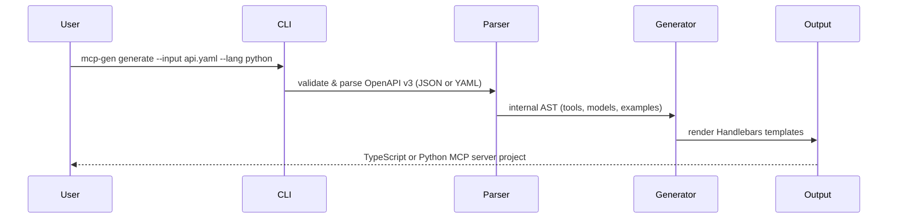

# MCP-Generator

OpenAPI → MCP Server generator

This tool generates a minimal MCP server from an OpenAPI (v3) spec using templates for TypeScript and Python.

Quick usage

- Generate from a local spec:

  mcp-gen generate -i openapi.json -l typescript -o ./mcp-server

- Initialize a local copy of a known public spec (registry) and optionally generate:

  mcp-gen init --from stripe
  mcp-gen init --from stripe --generate -o ./mcp-server

- Watch a spec file or URL and regenerate automatically (useful for CI):

  mcp-gen watch -i openapi.json -o ./mcp-server
  mcp-gen watch -i https://example.com/spec.json --interval 60000

Plugin system (templates & helpers)

Large orgs can provide custom templates and Handlebars helpers as a plugin. A plugin may be a folder containing:

- `templates/typescript/...` or `templates/python/...` — any template files to override or extend core templates
- `index.js` that exports `registerHandlebars(handlebars)` to register helpers

Load a plugin with `--plugin` when generating or watching:

  mcp-gen generate -i openapi.json --plugin ./my-company-plugin
  mcp-gen watch -i openapi.json --plugin ./my-company-plugin

Behavior notes

- Plugin templates override core templates when a file with the same name exists in the plugin's `templates/<lang>/` folder.
- Plugins may register Handlebars helpers by exporting a `registerHandlebars` function which receives the Handlebars instance.

See the Portuguese README for localized instructions: `README.pt-BR.md`.
# openapi-to-mcp

> Turn any OpenAPI spec into a ready-to-run MCP server in seconds.

```bash
mcp-gen generate --input openapi.yaml --lang typescript --out ./my-server
```

No boilerplate. No manual wiring. Just a working [Model Context Protocol](https://modelcontextprotocol.io) server with every endpoint mapped to a tool — in TypeScript or Python.

---

## Why

MCP became the standard way to expose APIs to AI agents in 2025/26. Writing MCP servers by hand means repeating the same scaffolding for every project — parsing specs, registering tools, handling schemas. `openapi-to-mcp` eliminates that entirely.

You bring the spec. The CLI brings the server.

---

## How it works



Each `path + method` in your spec becomes an MCP **tool** with:
- Typed input schema derived from parameters and request body
- Example response from the spec pre-wired as a stub
- Incremental markers so re-generation never overwrites your custom logic

---

## Requirements

- Node.js 20+
- npm 9+

---

## Installation

```bash
git clone https://github.com/your-username/openapi-to-mcp.git
cd openapi-to-mcp
npm install
npm run build
```

> npm publish coming soon — `npm install -g mcp-gen` will work once released.

---

## Usage

### Validate a spec

Accepts `.json`, `.yaml`, `.yml`, or a URL.

```bash
node dist/cli/index.js validate --input ./api/openapi.yaml
```

```
✔ Spec is valid

  Tools: 12  Models: 6  Base URL: https://api.example.com
```

### Generate a TypeScript server

```bash
node dist/cli/index.js generate \
  --input ./api/openapi.yaml \
  --lang typescript \
  --out ./my-server
```

```
✔ Generation complete

  ✓ 7 files created

    my-server/src/server.ts
    my-server/src/models.ts
    my-server/package.json
    my-server/tsconfig.json
    my-server/README.md
    my-server/Dockerfile
    my-server/.github/workflows/ci.yml
```

### Generate a Python server

```bash
node dist/cli/index.js generate \
  --input ./api/openapi.yaml \
  --lang python \
  --out ./my-server
```

```
✔ Generation complete

  ✓ 6 files created

    my-server/server.py
    my-server/models.py
    my-server/requirements.txt
    my-server/Dockerfile
    my-server/README.md
    my-server/.github/workflows/ci.yml
```

### Re-generate without losing your code (incremental)

```bash
node dist/cli/index.js generate \
  --input ./api/openapi.yaml \
  --out ./my-server \
  --incremental
```

```
✔ Generation complete

  ✓ 7 files created
  ↺ 3 handler(s) preserved

    ↺ get_users
    ↺ post_users
    ↺ get_users_id
```

Custom code between `@@mcp-gen` markers is preserved. Generated stubs are refreshed. Your logic is never touched.

### Accepts URLs too

```bash
node dist/cli/index.js generate \
  --input https://petstore3.swagger.io/api/v3/openapi.json \
  --out ./petstore-mcp
```

---

## CLI Reference

| Flag | Description | Default |
|------|-------------|---------|
| `--input`, `-i` | Path or URL to the OpenAPI spec (`.json` \| `.yaml` \| `.yml`) | required |
| `--out`, `-o` | Output directory for the generated project | `./mcp-server` |
| `--lang`, `-l` | Target language: `typescript` \| `python` | `typescript` |
| `--force`, `-f` | Overwrite existing files without prompting | `false` |
| `--incremental` | Preserve custom handler code on re-generation | `false` |
| `--name` | Override the server name | derived from spec title |
| `--server-version` | Override the server version | derived from spec |

---

## Generated project structure

**TypeScript:**
```
my-server/
├── src/
│   ├── server.ts        # MCP server — tool definitions + handlers
│   └── models.ts        # TypeScript interfaces from OpenAPI schemas
├── .github/
│   └── workflows/
│       └── ci.yml
├── Dockerfile
├── package.json
├── tsconfig.json
└── README.md
```

**Python:**
```
my-server/
├── server.py            # FastMCP server — tool definitions + handlers
├── models.py            # Pydantic models from OpenAPI schemas
├── requirements.txt
├── .github/
│   └── workflows/
│       └── ci.yml
├── Dockerfile
└── README.md
```

---

## Connect to Claude Desktop

**TypeScript:**
```json
{
  "mcpServers": {
    "my-server": {
      "command": "node",
      "args": ["/absolute/path/to/my-server/dist/server.js"]
    }
  }
}
```

**Python:**
```json
{
  "mcpServers": {
    "my-server": {
      "command": "python",
      "args": ["/absolute/path/to/my-server/server.py"]
    }
  }
}
```

Restart Claude Desktop. Your API tools appear automatically.

---

## Implement handlers

Generated files return spec examples by default. Replace stubs with real logic.

**TypeScript** (`src/server.ts`):
```typescript
case "get_users_id": {
  // @@mcp-gen:start:get_users_id
  const user = await db.users.findById(args.id);
  return { content: [{ type: "text", text: JSON.stringify(user) }] };
  // @@mcp-gen:end:get_users_id
}
```

**Python** (`server.py`):
```python
@mcp.tool()
async def get_users_id(id: float) -> Any:
    # @@mcp-gen:start:get_users_id
    user = await db.users.find_by_id(id)
    return user
    # @@mcp-gen:end:get_users_id
```

Code between `@@mcp-gen:start` and `@@mcp-gen:end` markers is preserved when you re-run `generate --incremental`.

---

## Development

```bash
npm test
npx tsc --noEmit

# TypeScript example
node dist/cli/index.js generate --input examples/petstore.json --out /tmp/ts-test --force

# Python example
node dist/cli/index.js generate --input examples/petstore.yaml --lang python --out /tmp/py-test --force

# Incremental example
node dist/cli/index.js generate --input examples/petstore.json --out /tmp/ts-test --incremental
```

---

## Roadmap

| Week | Status | Scope |
|------|--------|-------|
| 0–1 | ✅ Done | CLI, OpenAPI v3 parser, TypeScript generator, 7-file scaffold |
| 2 | ✅ Done | YAML input, Python/FastMCP target, incremental generation |
| 3 | 🔜 Next | `oneOf`/`anyOf` support, auth stubs, integration tests |
| 4 | Planned | Interactive CLI mode, npm/pip publish |
| 5 | Planned | `mcp-gen init --from stripe` — built-in spec registry |
| 6 | Planned | Release candidate, Product Hunt launch |

---

## Known limitations

- OpenAPI v2 (Swagger) is not supported — v3.x only
- `oneOf` / `anyOf` / `discriminator` schemas are partially handled
- `copy-templates` script uses `cp` — on Windows, change to `xcopy` in `package.json`

---

## License

MIT © 2026