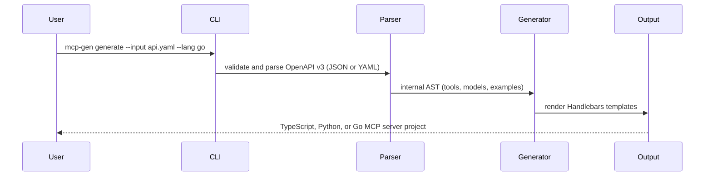

# MCP-Generator

> **Also available in:** [Português (Versão em Português)](README.pt-BR.md)

Generate MCP servers from OpenAPI specs.

> **Status**: `@christopher_dondici/mcp-gen` 2.1.2 is prepared for release and has not been published to npm. This release includes build, packaging, CI, and dependency fixes, with no new runtime features. Use the source quick start below. See [release notes](RELEASE_NOTES.md) (PT-BR).

`mcp-gen` turns an OpenAPI v3 spec into an MCP server in **TypeScript**, **Python**, or **Go**. It maps each route to a tool, generates typed models (including enums, oneOf/anyOf), and keeps custom code when you regenerate.

## Quick start

With Git, Node.js 20+ and npm 9+ installed, run:

```bash
git clone https://github.com/ChristopherDond/MCP-Generator.git
cd MCP-Generator
npm ci
npm run build
node dist/cli/index.js --version
```

Generate a server from a local spec:

```bash
node dist/cli/index.js generate -i examples/petstore.yaml -l typescript -o ./my-server
```

Validate a spec without generating files:

```bash
node dist/cli/index.js validate -i examples/petstore.yaml
```

Run these commands from the repository root on `main`. The build and packaging fixes are part of 2.1.2. Generation writes a scaffold; it does not install dependencies, build, or start the generated server.

Run the interactive CLI if you prefer prompts:

```bash
npm run dev
```

## What it does


```mermaid
sequenceDiagram
    participant User
    participant CLI
    participant Parser
    participant Generator
    participant Output

    User->>CLI: mcp-gen generate --input api.yaml --lang go
    CLI->>Parser: validate and parse OpenAPI v3 (JSON or YAML)
    Parser->>Generator: internal AST (tools, models, examples)
    Generator->>Output: render Handlebars templates
    Output-->>User: TypeScript, Python, or Go MCP server project
```

Each route becomes an MCP tool with:

- typed input from parameters (path, query, header, cookie, body) and request bodies
- example responses from the spec
- enum / oneOf / anyOf / discriminator schema support
- real HTTP client mode (`--http`) that calls the actual API
- scaffolded authContext checks for scoped metadata and credential-like argument keys; review before deployment
- optional incremental code preservation

## Requirements

- Node.js 20+
- npm 9+ (the source quick start uses the repository lockfile)
- Git to clone the repository
- (Optional) Python 3.8+ for Python projects
- (Optional) Go 1.22+ for Go projects

## Local installation and command shorthand

Use the source build in [Quick start](#quick-start) while npm publication remains unverified. Once version 2.1.2 is published and its availability on npm is confirmed, you can install it with `npm install -g @christopher_dondici/mcp-gen@2.1.2`.
Throughout this README, `mcp-gen` is shorthand for `node dist/cli/index.js` from the repository root. For example, `mcp-gen validate -i examples/petstore.yaml` means `node dist/cli/index.js validate -i examples/petstore.yaml`.

Optionally, run `npm link` from the repository root after building to make the `mcp-gen` command point to your local checkout. This changes npm's global links; it does not download a published `@christopher_dondici/mcp-gen` package. The npm package name changed because `mcp-gen` was rejected for similarity to `mcpgen`; the command remains `mcp-gen`.

To install a locally produced tarball without publishing:

```bash
npm install ./christopher_dondici-mcp-gen-2.1.2.tgz
./node_modules/.bin/mcp-gen --version
./node_modules/.bin/mcp-gen validate -i node_modules/@christopher_dondici/mcp-gen/examples/petstore.yaml
```

## CLI

### Commands

- `mcp-gen generate` or `mcp-gen g` creates a server from a spec.
- `mcp-gen validate` or `mcp-gen v` checks a spec with detailed warnings (name collisions, missing examples, unsupported schemas).
- `mcp-gen init` downloads a known public spec and can generate a project.
- `mcp-gen watch` watches a file or URL and regenerates on changes.

### Generate

```bash
mcp-gen generate -i ./api/openapi.yaml -l typescript -o ./my-server
mcp-gen generate -i ./api/openapi.yaml -l python -o ./my-server
mcp-gen generate -i ./api/openapi.yaml -l go -o ./my-server
```

**Useful flags:**

- `--force`, `-f` overwrites existing files.
- `--incremental` keeps code between `@@mcp-gen:start` and `@@mcp-gen:end`.
- `--http` generates handlers that **call the real API** over HTTP instead of returning example stubs.
- `--env-file <path>` embeds TOKEN/BASE_URL from a .env-style file into the generated client.
- `--name <name>` sets the server name.
- `--server-version <version>` sets the server version.
- `--plugin <path>` loads a plugin module or folder (can be repeated).

### Validate (v2.1+)

```bash
mcp-gen validate -i ./api/openapi.yaml
```

Outputs a rich report:

```
Spec is valid
  Tools: 12  Models: 8  Base URL: https://api.example.com

  2 warning(s):
  ⚠ Tool name collision resolved: "get_users" appears 2x (unique suffixes added)
  ⚠ 3 tool(s) have no example response: get_users_id, delete_user, patch_user
```

### Security and lint (v2.1.1)

```bash
node dist/cli/index.js security -p ./my-server
node dist/cli/index.js security -p ./my-server --fail-on-warn
```

Scans generated files for credential-like patterns, authorization-related identifiers, naming, descriptions, and incremental markers. `--json` prints a JSON report, but the CLI also prints a header; stdout is not a pure JSON document. Errors cause exit code 1; `--fail-on-warn` also fails on warnings. This is static analysis, not a security guarantee.

### Init

`init` uses the built-in registry:

```bash
mcp-gen init --from list
mcp-gen init --from stripe
mcp-gen init --from stripe --generate -o ./stripe-mcp
```

Available registry keys:

| Key | Description |
|-----|-------------|
| `stripe` | Stripe Payment API |
| `github` | GitHub REST API |
| `slack` | Slack Web API |
| `openai` | OpenAI API |
| `petstore` | Swagger Petstore example |
| `twilio` | Twilio Communications API |
| `shopify` | Shopify Admin API |
| `kubernetes` | Kubernetes API |
| `digitalocean` | DigitalOcean API |
| `azure` | Azure Resource Manager API |

### Watch

```bash
mcp-gen watch -i ./api/openapi.yaml -o ./my-server
mcp-gen watch -i https://example.com/spec.json --interval 60000
```

For URL inputs, `--interval <ms>` controls the polling interval. `--once` runs generation once and exits after the first change.

## Plugins

Plugins can override templates and register extra Handlebars helpers.

Basic structure:

- `templates/typescript/...`, `templates/python/...`, or `templates/go/...` for `.hbs` template overrides
- `index.js` that exports `registerHandlebars(handlebars)` for custom helpers

Example:

```bash
mcp-gen generate -i ./api/openapi.yaml --plugin ./my-plugin
mcp-gen watch -i ./api/openapi.yaml --plugin ./my-plugin
```

Plugin templates override core templates when they use the same path under `templates/<lang>/`.

## Generated project structure

**TypeScript:**

```
my-server/
├── src/
│   ├── server.ts        # MCP server — tool definitions + handlers
│   ├── models.ts        # TypeScript interfaces from OpenAPI schemas (enums, unions)
│   └── client.ts        # HTTP client (used in --http mode)
├── .github/
│   └── workflows/
│       └── ci.yml
├── Dockerfile
├── package.json
├── tsconfig.json
└── README.md
```

**Python:**

```
my-server/
├── server.py            # FastMCP server — tool definitions + handlers
├── models.py            # Pydantic models from OpenAPI schemas (enums, unions)
├── requirements.txt
├── .github/
│   └── workflows/
│       └── ci.yml
├── Dockerfile
└── README.md
```

**Go (new in v2.1):**

```
my-server/
├── main.go              # MCP server using mark3labs/mcp-go
├── models.go            # Go types from OpenAPI schemas (enums, unions)
├── client.go            # HTTP client (used in --http mode)
├── go.mod
├── .github/
│   └── workflows/
│       └── ci.yml
├── Dockerfile
└── README.md
```

---

## Connect to Claude Desktop

**TypeScript:**

```json
{
  "mcpServers": {
    "my-server": {
      "command": "node",
      "args": ["/absolute/path/to/my-server/dist/server.js"]
    }
  }
}
```

**Python:**

```json
{
  "mcpServers": {
    "my-server": {
      "command": "python",
      "args": ["/absolute/path/to/my-server/server.py"]
    }
  }
}
```

**Go:**

```json
{
  "mcpServers": {
    "my-server": {
      "command": "go",
      "args": ["run", "/absolute/path/to/my-server/main.go"]
    }
  }
}
```

Restart Claude Desktop. Your API tools appear automatically.

---

## Security & `authContext` Contract

The generated tools expect **scoped authorization metadata** (not raw credentials):

```json
{
  "tokenId": "tok_abc123",
  "principal": "user:42",
  "expiresAt": "2026-05-11T14:00:00Z",
  "allowedTools": ["get_orders"],
  "endpointAllowlist": ["GET /orders"],
  "spendLimitUsd": 5,
  "spendUsedUsd": 1.2,
  "revoked": false,
  "requestId": "req_01J..."
}
```

The scaffold blocks arguments like `token`, `authorization`, `api_key`, `client_secret`, `password`, `secret` by default.

**Quick example (env var):**

```bash
# Linux / macOS
export TOKEN=your_api_key_here

# Windows (PowerShell)
$env:TOKEN='your_api_key_here'
```

For advanced integrations and management, consider Cohesivity.ai as a backend for auth, storage, and revocation policies.

---

## Implement handlers

Generated files return spec examples by default. Replace stubs with real logic.

**TypeScript** (`src/server.ts`):

```typescript
case "get_users_id": {
  // @@mcp-gen:start:get_users_id
  const user = await db.users.findById(args.id);
  return { content: [{ type: "text", text: JSON.stringify(user) }] };
  // @@mcp-gen:end:get_users_id
}
```

**Python** (`server.py`):

```python
@mcp.tool()
async def get_users_id(id: float, auth_context: dict | None = None) -> Any:
    # @@mcp-gen:start:get_users_id
    user = await db.users.find_by_id(id)
    return user
    # @@mcp-gen:end:get_users_id
```

**Go** (`main.go`):

```go
s.AddTool(get_users_idTool, func(ctx context.Context, request mcp.CallToolRequest) (*mcp.CallToolResult, error) {
    // @@mcp-gen:start:get_users_id
    return jsonSerialize(jsonExample(`{"id": 1, "name": "Alice"}`))
    // @@mcp-gen:end:get_users_id
})
```

Code between `@@mcp-gen:start` and `@@mcp-gen:end` markers is preserved when you re-run `generate --incremental`.

---

## Programmatic API (Library Mode)

With the local tarball installed, import the scoped package as shown below. From the repository root after building, use `"./dist/index.js"` instead; neither approach requires npm publication.

```typescript
import { generate, validateSpec, parseOpenAPI } from "@christopher_dondici/mcp-gen";

const result = await generate({
  input: "./api/openapi.yaml",
  lang: "typescript",
  out: "./my-server",
  force: true,
  incremental: false,
  http: false,
});

const validation = await validateSpec("./api/openapi.yaml");
console.log(validation.tools, validation.models, validation.warnings);
```

---

## Development

```bash
npm test
npx tsc --noEmit

# TypeScript example
node dist/cli/index.js generate --input examples/petstore.json --out /tmp/ts-test --force

# Python example
node dist/cli/index.js generate --input examples/petstore.yaml --lang python --out /tmp/py-test --force

# Go example
node dist/cli/index.js generate --input examples/petstore.json --lang go --out /tmp/go-test --force

# HTTP mode (real API calls)
node dist/cli/index.js generate --input examples/petstore.json --lang typescript --out /tmp/ts-http --force --http

# Incremental example
node dist/cli/index.js generate --input examples/petstore.json --out /tmp/ts-test --incremental
```

---

## Roadmap

| Stage | Status | Scope |
|-------|--------|-------|
| Existing features | Implemented | CLI, OpenAPI v3 parser, TypeScript/Python generation, incremental generation, interactive mode, spec registry, plugins |
| v2.1.0 | Tagged | Go target, HTTP mode, enums, header/cookie params, library API, rich validate |
| v2.1.1 | Tagged | Static security/lint scanning and Go server template checks; TypeScript/Python templates unchanged from v2.1.0 |
| v2.1.2 | Prepared for release | Portable template copy, lockfile, package allowlist, prepack build, corrected release workflow, CI tarball smoke test, dependency updates |
| Distribution | Unverified | npm publication of 2.1.2 must be confirmed before registry installation; pip publication is not established. Python is a generation target, not a pip installation path for this CLI |
| Future | Planned | Streaming/resources/prompts, OpenAPI v2, more registries |

---

## Known limitations

- OpenAPI v2 (Swagger) is not supported — v3.x only
- `oneOf` / `anyOf` / `discriminator` schemas generate union types but no runtime validation
- Security/lint scanning uses static text patterns and can produce false positives or miss issues. A passing report does not guarantee security or verify runtime authorization, revocation, spending, or audit logging
- Generated authorization checks are scaffolding, not a complete security backend; review and test them before deployment
- Streaming/resources/prompts are not implemented

The `copy-templates` fix included in 2.1.2 uses Node.js `fs.cpSync` on Windows, Linux, and macOS; it no longer requires `cp` or `xcopy`. CI currently runs on Ubuntu only.

---

## License

MIT © 2026 - Christopher D.