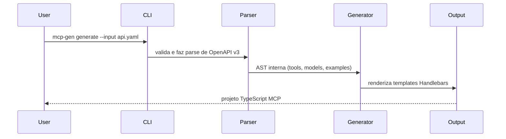

# openapi-to-mcp

> Transforme qualquer especificação OpenAPI em um servidor MCP pronto para uso em segundos.

English version: [README.md](README.md)

```bash
mcp-gen generate --input openapi.json --out ./my-server
```

Sem boilerplate. Sem wiring manual. Apenas um servidor [Model Context Protocol](https://modelcontextprotocol.io) funcional, com cada endpoint mapeado para uma tool e exemplos incluídos.

---

## Por que

O MCP se tornou a forma padrão de expor APIs para agentes de IA em 2025/26. Escrever servidores MCP na mão significa repetir a mesma estrutura em todo projeto: parser de specs, registro de tools, tratamento de schemas. O `openapi-to-mcp` elimina isso.

Você traz a spec. A CLI entrega o servidor.

---

## Como funciona



Cada `path + method` da sua spec vira uma **tool** MCP com:
- Schema de entrada tipado a partir de parâmetros e request body
- Exemplo de resposta vindo da spec (ou um stub `NotImplemented`)
- Comentários JSDoc completos

---

## Requisitos

- Node.js 20+
- npm 9+

---

## Instalação

```bash
# Clone e instale
git clone https://github.com/your-username/openapi-to-mcp.git
cd openapi-to-mcp
npm install
npm run build
```

> Publicação no npm em breve — `npm install -g mcp-gen` vai funcionar quando estiver liberado.

---

## Uso

### Validar uma spec

```bash
node dist/cli/index.js validate --input ./api/openapi.json
```

```
✔ Spec is valid

  Tools: 12  Models: 6  Base URL: https://api.example.com
```

### Gerar um servidor

```bash
node dist/cli/index.js generate \
  --input ./api/openapi.json \
  --out ./generated/my-server
```

```
✔ Generation complete

  ✓ 7 files created

    /generated/my-server/src/server.ts
    /generated/my-server/src/models.ts
    /generated/my-server/package.json
    /generated/my-server/tsconfig.json
    /generated/my-server/README.md
    /generated/my-server/Dockerfile
    /generated/my-server/.github/workflows/ci.yml
```

### Executar o servidor gerado

```bash
cd generated/my-server
npm install
npm run build
npm start
```

### Também aceita URLs

```bash
node dist/cli/index.js generate \
  --input https://petstore3.swagger.io/api/v3/openapi.json \
  --out ./petstore-mcp
```

---

## Referência da CLI

| Flag | Descrição | Padrão |
|------|-----------|--------|
| `--input`, `-i` | Caminho ou URL da spec OpenAPI (JSON ou YAML) | obrigatório |
| `--out`, `-o` | Diretório de saída do projeto gerado | `./mcp-server` |
| `--lang`, `-l` | Linguagem alvo: `typescript` | `typescript` |
| `--force`, `-f` | Sobrescreve arquivos existentes sem perguntar | `false` |
| `--name` | Override do nome do servidor | derivado do título da spec |
| `--version` | Override da versão do servidor | derivado da spec |

---

## Estrutura do projeto gerado

```
my-server/
├── src/
│   ├── server.ts        # MCP server — definições de tools + handlers
│   └── models.ts        # Interfaces TypeScript geradas a partir dos schemas OpenAPI
├── .github/
│   └── workflows/
│       └── ci.yml       # GitHub Actions: build + test
├── Dockerfile           # Imagem multi-stage para produção
├── package.json
├── tsconfig.json
└── README.md            # Guia de uso do servidor gerado
```

---

## Conectar ao Claude Desktop

Adicione o servidor gerado ao arquivo `claude_desktop_config.json`:

```json
{
  "mcpServers": {
    "my-server": {
      "command": "node",
      "args": ["/absolute/path/to/my-server/dist/server.js"]
    }
  }
}
```

Reinicie o Claude Desktop. As tools da sua API vão aparecer automaticamente.

---

## Implementar handlers

O `src/server.ts` gerado retorna exemplos da spec por padrão. Troque os stubs por lógica real:

```typescript
case "get_users_id": {
  const user = await db.users.findById(args.id);
  return {
    content: [{ type: "text", text: JSON.stringify(user) }],
  };
}
```

Tools sem exemplo de resposta na spec vão lançar `NotImplemented` — a CLI avisa quais são antes.

---

## Desenvolvimento

```bash
# Rodar testes
npm test

# Apenas type-check
npx tsc --noEmit

# Testar a spec de exemplo
node dist/cli/index.js generate --input examples/petstore.json --out /tmp/petstore --force
```

---

## Roadmap

| Semana | Status | Escopo |
|--------|--------|--------|
| 0–1 | ✅ Concluído | CLI, parser OpenAPI v3, gerador TypeScript, scaffold com 7 arquivos |
| 2 | 🔜 Próximo | Target Python/FastAPI, suporte a YAML |
| 3 | Planejado | Polimento do Dockerfile, testes de integração, melhorias no template de CI |
| 4 | Planejado | CLI interativa, publicação npm/pip |
| 5 | Planejado | Geração incremental — preservar blocos de código customizados |
| 6 | Planejado | Release candidate, lançamento no Product Hunt |

---

## Limitações conhecidas

- OpenAPI v2 (Swagger) não é suportado — apenas v3.x
- Schemas com `oneOf` / `anyOf` / `discriminator` são tratados parcialmente (MVP)
- O target Python ainda não foi implementado
- O script `copy-templates` usa `xcopy` no Windows; ajuste se estiver em outro ambiente

---

## Licença

MIT © 2026
