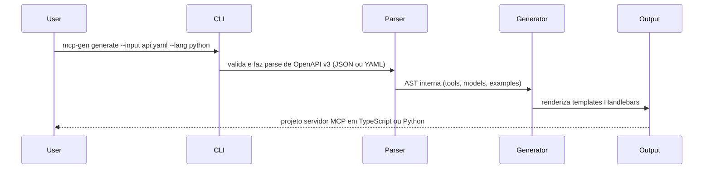

# openapi-to-mcp

> Transforme qualquer especificação OpenAPI em um servidor MCP pronto para uso em segundos.

```bash
mcp-gen generate --input openapi.yaml --lang typescript --out ./my-server
```

Sem boilerplate. Sem wiring manual. Apenas um servidor [Model Context Protocol](https://modelcontextprotocol.io) funcional, com cada endpoint mapeado para uma tool, em TypeScript ou Python.

---

## Por que

O MCP se tornou a forma padrão de expor APIs para agentes de IA em 2025/26. Escrever servidores MCP na mão significa repetir a mesma estrutura em todo projeto: parsing de specs, registro de tools e tratamento de schemas. O `openapi-to-mcp` elimina tudo isso.

Você traz a spec. A CLI entrega o servidor.

---

## Como funciona



Cada `path + method` da sua spec vira uma **tool** MCP com:
- Schema de entrada tipado a partir de parâmetros e request body
- Exemplo de resposta vindo da spec já conectado como stub
- Marcadores incrementais para que novas gerações nunca sobrescrevam sua lógica customizada

---

## Requisitos

- Node.js 20+
- npm 9+

---

## Instalação

```bash
git clone https://github.com/your-username/openapi-to-mcp.git
cd openapi-to-mcp
npm install
npm run build
```

> Publicação no npm em breve — `npm install -g mcp-gen` vai funcionar quando estiver liberado.

---

## Uso

### Validar uma spec

Aceita `.json`, `.yaml`, `.yml` ou uma URL.

```bash
node dist/cli/index.js validate --input ./api/openapi.yaml
```

```
✔ Spec is valid

  Tools: 12  Models: 6  Base URL: https://api.example.com
```

### Gerar um servidor TypeScript

```bash
node dist/cli/index.js generate \
  --input ./api/openapi.yaml \
  --lang typescript \
  --out ./my-server
```

```
✔ Generation complete

  ✓ 7 files created

    my-server/src/server.ts
    my-server/src/models.ts
    my-server/package.json
    my-server/tsconfig.json
    my-server/README.md
    my-server/Dockerfile
    my-server/.github/workflows/ci.yml
```

### Gerar um servidor Python

```bash
node dist/cli/index.js generate \
  --input ./api/openapi.yaml \
  --lang python \
  --out ./my-server
```

```
✔ Generation complete

  ✓ 6 files created

    my-server/server.py
    my-server/models.py
    my-server/requirements.txt
    my-server/Dockerfile
    my-server/README.md
    my-server/.github/workflows/ci.yml
```

### Regenerar sem perder seu código (incremental)

```bash
node dist/cli/index.js generate \
  --input ./api/openapi.yaml \
  --out ./my-server \
  --incremental
```

```
✔ Generation complete

  ✓ 7 files created
  ↺ 3 handler(s) preserved

    ↺ get_users
    ↺ post_users
    ↺ get_users_id
```

Código customizado entre os marcadores `@@mcp-gen` é preservado. Os stubs gerados são atualizados. Sua lógica nunca é tocada.

### Também aceita URLs

```bash
node dist/cli/index.js generate \
  --input https://petstore3.swagger.io/api/v3/openapi.json \
  --out ./petstore-mcp
```

---

### Inicializar a partir do registro público

É possível baixar specs públicas conhecidas (ex.: `stripe`, `github`) diretamente para o diretório atual:

```bash
# baixa `openapi.stripe.json` para o diretório de trabalho
mcp-gen init --from stripe

# baixa e já gera o projeto
mcp-gen init --from stripe --generate -o ./my-server
```

### Modo watch

Observe um spec local ou remoto e regenere automaticamente quando ele mudar — útil para fluxos de CI que atualizam a spec:

```bash
# observa um arquivo local
mcp-gen watch -i openapi.json -o ./my-server

# observa uma URL (polling interval em ms)
mcp-gen watch -i https://example.com/spec.json --interval 60000
```

### Sistema de plugins (templates e helpers)

Empresas maiores podem fornecer templates e helpers Handlebars customizados para padronizar a geração interna.

Requisitos básicos de um plugin:

- `templates/typescript/...` ou `templates/python/...` — arquivos `.hbs` que substituem ou complementam os templates do core
- `index.js` (opcional) que exporta `registerHandlebars(handlebars)` para registrar helpers adicionais

Carregue um plugin com a flag `--plugin` ao gerar ou assistir:

```bash
mcp-gen generate -i openapi.json --plugin ./meu-plugin
mcp-gen watch -i openapi.json --plugin ./meu-plugin
```

Comportamento:

- Se um template com o mesmo nome existir no plugin em `templates/<lang>/`, ele sobrescreverá o template core.
- Se o plugin exportar `registerHandlebars`, essa função será chamada com a instância Handlebars para registrar helpers.


## Referência da CLI

| Flag | Descrição | Padrão |
|------|-----------|--------|
| `--input`, `-i` | Caminho ou URL da spec OpenAPI (`.json` \| `.yaml` \| `.yml`) | obrigatório |
| `--out`, `-o` | Diretório de saída do projeto gerado | `./mcp-server` |
| `--lang`, `-l` | Linguagem alvo: `typescript` \| `python` | `typescript` |
| `--force`, `-f` | Sobrescreve arquivos existentes sem perguntar | `false` |
| `--incremental` | Preserva código customizado dos handlers ao regenerar | `false` |
| `--name` | Sobrescreve o nome do servidor | derivado do título da spec |
| `--server-version` | Sobrescreve a versão do servidor | derivada da spec |

---

## Estrutura do projeto gerado

**TypeScript:**
```
my-server/
├── src/
│   ├── server.ts        # MCP server — definições de tools + handlers
│   └── models.ts        # Interfaces TypeScript geradas a partir dos schemas OpenAPI
├── .github/
│   └── workflows/
│       └── ci.yml
├── Dockerfile
├── package.json
├── tsconfig.json
└── README.md
```

**Python:**
```
my-server/
├── server.py            # Servidor FastMCP — definições de tools + handlers
├── models.py            # Modelos Pydantic gerados a partir dos schemas OpenAPI
├── requirements.txt
├── .github/
│   └── workflows/
│       └── ci.yml
├── Dockerfile
└── README.md
```

---

## Conectar ao Claude Desktop

**TypeScript:**
```json
{
  "mcpServers": {
    "my-server": {
      "command": "node",
      "args": ["/absolute/path/to/my-server/dist/server.js"]
    }
  }
}
```

**Python:**
```json
{
  "mcpServers": {
    "my-server": {
      "command": "python",
      "args": ["/absolute/path/to/my-server/server.py"]
    }
  }
}
```

Reinicie o Claude Desktop. As tools da sua API vão aparecer automaticamente.

---

## Implementar handlers

Os arquivos gerados retornam exemplos da spec por padrão. Substitua os stubs pela lógica real.

**TypeScript** (`src/server.ts`):
```typescript
case "get_users_id": {
  // @@mcp-gen:start:get_users_id
  const user = await db.users.findById(args.id);
  return { content: [{ type: "text", text: JSON.stringify(user) }] };
  // @@mcp-gen:end:get_users_id
}
```

**Python** (`server.py`):
```python
@mcp.tool()
async def get_users_id(id: float) -> Any:
    # @@mcp-gen:start:get_users_id
    user = await db.users.find_by_id(id)
    return user
    # @@mcp-gen:end:get_users_id
```

Código entre os marcadores `@@mcp-gen:start` e `@@mcp-gen:end` é preservado quando você roda `generate --incremental` novamente.

---

## Desenvolvimento

```bash
npm test
npx tsc --noEmit

# Exemplo TypeScript
node dist/cli/index.js generate --input examples/petstore.json --out /tmp/ts-test --force

# Exemplo Python
node dist/cli/index.js generate --input examples/petstore.yaml --lang python --out /tmp/py-test --force

# Exemplo incremental
node dist/cli/index.js generate --input examples/petstore.json --out /tmp/ts-test --incremental
```

---

## Roadmap

| Semana | Status | Escopo |
|------|--------|--------|
| 0–1 | ✅ Concluído | CLI, parser OpenAPI v3, gerador TypeScript, scaffold com 7 arquivos |
| 2 | ✅ Concluído | Entrada YAML, target Python/FastMCP, geração incremental |
| 3 | 🔜 Próximo | Suporte a `oneOf`/`anyOf`, stubs de auth, testes de integração |
| 4 | Planejado | CLI interativa, publicação npm/pip |
| 5 | Planejado | `mcp-gen init --from stripe` — registry de specs embutido |
| 6 | Planejado | Release candidate, lançamento no Product Hunt |

---

## Limitações conhecidas

- OpenAPI v2 (Swagger) não é suportado — apenas v3.x
- `oneOf` / `anyOf` / `discriminator` são parcialmente tratados
- O script `copy-templates` usa `cp` — no Windows, troque para `xcopy` no `package.json`

---

## Licença

MIT © 2026
