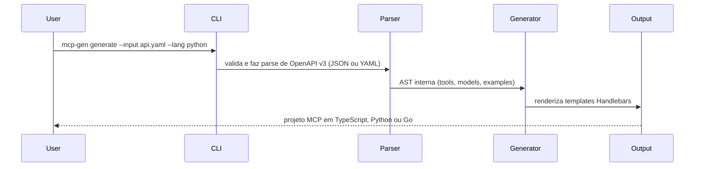

# MCP-Generator

> **Também disponível em:** [English (English Version)](README.md)

Gere servidores MCP a partir de specs OpenAPI.

> **Status**: `@christopher_dondici/mcp-gen` 2.1.4 é a última versão publicada no npm e inclui os recursos de filtro, agrupamento e preservação incremental abaixo. Veja as [notas de release](RELEASE_NOTES.md).

`mcp-gen` transforma uma spec OpenAPI v3 em um servidor [Model Context Protocol](https://modelcontextprotocol.io) em TypeScript, Python ou Go. Cada rota vira uma tool, e a geração incremental preserva o código customizado entre os marcadores indicados.

## Novidades da 2.1.4

(A tag `v2.1.3` foi substituída antes de chegar ao npm; tudo abaixo saiu na 2.1.4, além da correção do middleware de auth gerado para specs sem `securitySchemes`.)

- Filtro de paths com globs: `--path-prefix "/users/**"`, `--include-paths`, `--exclude-paths`; `--operation-allowlist op1,op2` inline (arquivo continua suportado).
- Agregação com `--group-by tag | path-prefix`: uma tool lógica por tag ou segmento de path, com roteamento interno por `action` (nome da operação + method).
- Dedup de nomes: em colisão, sufixa com o method e depois com hash curto do path.
- Guardas incrementais: regiões `<generated:handlers>` mais marcadores `@@mcp-gen` por tool, merge 3-way com `--incremental`, `--force` para sobrescrever.
- Middleware de auth separado (`src/auth.ts`, `auth.py`, `auth.go`) gerado a partir de `securitySchemes`, e arquivos `handlers.custom.*` que nunca são sobrescritos sem `--force`.

## Início rápido

Com Git, Node.js 20+ e npm 9+ instalados, execute:

```bash
git clone https://github.com/ChristopherDond/MCP-Generator.git
cd MCP-Generator
npm ci
npm run build
node dist/cli/index.js --version
```

Gerar um servidor a partir de uma spec local:

```bash
node dist/cli/index.js generate -i examples/petstore.yaml -l typescript -o ./my-server
```

Validar uma spec sem gerar arquivos:

```bash
node dist/cli/index.js validate -i examples/petstore.yaml
```

Execute esses comandos na raiz do repositório, na branch `main`. As correções de build e empacotamento fazem parte da 2.1.2. A geração cria um scaffold; não instala dependências, compila ou inicia o servidor gerado.

Use a CLI interativa se preferir prompts:

```bash
npm run dev
```

## O que a ferramenta faz


```mermaid
sequenceDiagram
    participant User
    participant CLI
    participant Parser
    participant Generator
    participant Output

    User->>CLI: mcp-gen generate --input api.yaml --lang python
    CLI->>Parser: valida e faz parse de OpenAPI v3 (JSON ou YAML)
    Parser->>Generator: AST interna (tools, models, examples)
    Generator->>Output: renderiza templates Handlebars
    Output-->>User: projeto MCP em TypeScript, Python ou Go
```

Cada rota vira uma tool MCP com:

- entrada tipada a partir de parâmetros (path, query, header, cookie, body) e request bodies
- respostas de exemplo da spec
- suporte a schemas enum / oneOf / anyOf / discriminator
- modo HTTP client real (`--http`) que chama a API de verdade
- verificações scaffold de authContext para metadados com escopo e bloqueio de chaves parecidas com credenciais; revise antes do deploy
- preservação opcional de código incremental

## Requisitos

- Node.js 20+
- npm 9+ (o início rápido usa o lockfile do repositório)
- Git para clonar o repositório
- (Opcional) Python 3.8+ para projetos Python
- (Opcional) Go 1.22+ para projetos Go

## Instalação local e comandos abreviados

Instale a última versão com `npm install -g @christopher_dondici/mcp-gen@2.1.4`. Para trabalhar pelo código-fonte, use o build em [Início rápido](#início-rápido).
Neste README, `mcp-gen` é uma abreviação de `node dist/cli/index.js`, executado na raiz do repositório. Por exemplo, `mcp-gen validate -i examples/petstore.yaml` equivale a `node dist/cli/index.js validate -i examples/petstore.yaml`.

Opcionalmente, execute `npm link` na raiz após o build para disponibilizar o comando `mcp-gen` apontando para seu checkout local. Isso altera os links globais do npm; não baixa um pacote `@christopher_dondici/mcp-gen` publicado. O nome npm mudou porque `mcp-gen` foi recusado por similaridade com `mcpgen`; o comando continua sendo `mcp-gen`.

Para instalar um tarball produzido localmente sem publicar:

```bash
npm install ./christopher_dondici-mcp-gen-2.1.4.tgz
./node_modules/.bin/mcp-gen --version
./node_modules/.bin/mcp-gen validate -i node_modules/@christopher_dondici/mcp-gen/examples/petstore.yaml
```

## CLI

### Comandos

- `mcp-gen generate` ou `mcp-gen g` cria um servidor a partir de uma spec.
- `mcp-gen validate` ou `mcp-gen v` confere uma spec sem gerar arquivos.
- `mcp-gen init` baixa uma spec pública conhecida e pode gerar um projeto.
- `mcp-gen watch` observa um arquivo ou URL e regenera quando houver mudança.

### Gerar

```bash
mcp-gen generate -i ./api/openapi.yaml -l typescript -o ./my-server
mcp-gen generate -i ./api/openapi.yaml -l python -o ./my-server
mcp-gen generate -i ./api/openapi.yaml -l go -o ./my-server
```

Flags úteis:

- `--force`, `-f` sobrescreve arquivos, ignorando handlers preservados e arquivos custom (pula o merge 3-way).
- `--incremental` mantém o código entre `@@mcp-gen:start` e `@@mcp-gen:end` (também `<generated:handlers:name>`). Usa merge 3-way: stub novo vs seu código vs template novo.
- `--http` gera handlers que chamam a API real via HTTP em vez de retornar stubs de exemplo.
- `--env-file <path>` embute TOKEN/BASE_URL de um arquivo estilo .env no client gerado.
- `--name <name>` define o nome do servidor.
- `--server-version <version>` define a versão do servidor.
- `--plugin <path>` carrega um plugin.
- `--include-tags <a,b>` inclui só tools com essas tags.
- `--exclude-tags <a,b>` exclui tools com essas tags.
- `--path-prefix <glob>` inclui só paths com esse prefixo ou glob (`/users`, `/users/**`, `/pets/*`).
- `--include-paths <globs>` globs de path separados por vírgula para incluir.
- `--exclude-paths <globs>` globs de path separados por vírgula para excluir.
- `--operation-allowlist <ops>` lista `operationId`, nome da tool ou `METHOD /path` separada por vírgula, ou caminho de arquivo allowlist (array JSON ou separado por linha/vírgula).
- `--group-by <mode>` agrega em uma tool lógica por grupo: `tag` ou `path-prefix`. Cada grupo roteia por `action` internamente.

### Exemplos de filtro

```bash
mcp-gen generate -i api.yaml -o ./out --include-tags pets,orders
mcp-gen generate -i api.yaml -o ./out --exclude-tags admin
mcp-gen generate -i api.yaml -o ./out --path-prefix "/users/**"
mcp-gen generate -i api.yaml -o ./out --include-paths "/users/**,/orders/*" --exclude-paths "/users/internal/*"
mcp-gen generate -i api.yaml -o ./out --operation-allowlist listPets,createPet
mcp-gen generate -i api.yaml -o ./out --operation-allowlist ./allow.json
mcp-gen generate -i api.yaml -o ./out --include-tags pets --group-by tag
```

### Agrupamento

`--group-by tag` emite uma tool por tag (mais `untagged`): 200 operações em 8 tags viram ~8 tools. `--group-by path-prefix` emite uma tool por primeiro segmento (`/users/**` vira `users_group`). Cada grupo recebe um `action` obrigatório (enum com os nomes das operações) e roteia por `METHOD` + `path`. Parâmetros dos membros são unidos como opcionais.

### Dedup de nomes

Nomes vêm de `METHOD + path` (`GET /pets/{id}` vira `get_pets_petid`). O `operationId` é guardado para o allowlist. Em colisão, o gerador sufixa com o method e depois com um hash curto do path, em vez de gerar tools duplicadas.

### Middleware de auth

Projetos gerados incluem camada de auth separada a partir de `securitySchemes`:

- TypeScript: `src/auth.ts`
- Python: `auth.py`
- Go: `auth.go`

Deixe a lógica de negócio nos guardas; auth e validação ficam no middleware.

### Como não sobrescrever suas edições

Handlers gerados vêm com duas marcas:

```typescript
// <generated:handlers>
// @@mcp-gen:start:get_pets
// ... seu código aqui ...
// @@mcp-gen:end:get_pets
// </generated:handlers>
```

Regras:

1. Edite só entre `@@mcp-gen:start:<tool>` e `@@mcp-gen:end:<tool>` (ou `<generated:handlers:<tool>>`). Esse corpo é preservado no regen.
2. Coloque lógica reutilizável em `src/handlers.custom.ts` (TS), `handlers_custom.py` (Python) ou `handlers_custom.go` (Go). Esse arquivo é criado uma vez e nunca sobrescrito sem `--force`.
3. Regenere com `generate --incremental`. O gerador faz merge 3-way (stub novo vs seu código vs template novo) e lista handlers `preserved` e avisos `Merged ... custom handlers preserved`. Use `--force` para ignorar e sobrescrever tudo.

### Validar

```bash
mcp-gen validate -i ./api/openapi.yaml
```

Formatos aceitos: `.json`, `.yaml`, `.yml` ou uma URL.

### Segurança e lint (v2.1.1)

```bash
node dist/cli/index.js security -p ./my-server
node dist/cli/index.js security -p ./my-server --fail-on-warn
```

Analisa arquivos gerados buscando padrões semelhantes a credenciais, identificadores ligados à autorização, nomes, descrições e marcadores incrementais. `--json` imprime um relatório JSON, mas a CLI também imprime um cabeçalho; stdout não é um documento JSON puro. Erros resultam em código de saída 1; `--fail-on-warn` também falha com avisos. É análise estática, não garantia de segurança.

### Init

`init` usa o registry interno:

```bash
mcp-gen init --from list
mcp-gen init --from stripe
mcp-gen init --from stripe --generate -o ./stripe-mcp
```

Chaves disponíveis no registry:

| Chave | Descrição |
|-----|-------------|
| `stripe` | Stripe Payment API |
| `github` | GitHub REST API |
| `slack` | Slack Web API |
| `openai` | OpenAI API |
| `petstore` | Exemplo Swagger Petstore |
| `twilio` | Twilio Communications API |
| `shopify` | Shopify Admin API |
| `kubernetes` | Kubernetes API |
| `digitalocean` | DigitalOcean API |
| `azure` | Azure Resource Manager API |

### Watch

```bash
mcp-gen watch -i ./api/openapi.yaml -o ./my-server
mcp-gen watch -i https://example.com/spec.json --interval 60000
```

Para entradas via URL, `--interval <ms>` controla o polling. `--once` gera uma vez e encerra após a primeira mudança.

## Plugins

Plugins podem sobrescrever templates e registrar helpers extras do Handlebars.

Estrutura básica:

- `templates/typescript/...`, `templates/python/...` ou `templates/go/...` para sobrescrever templates `.hbs`
- `index.js` que exporta `registerHandlebars(handlebars)` para helpers customizados

Exemplo:

```bash
mcp-gen generate -i ./api/openapi.yaml --plugin ./meu-plugin
mcp-gen watch -i ./api/openapi.yaml --plugin ./meu-plugin
```

Os templates do plugin substituem os do core quando usam o mesmo caminho em `templates/<lang>/`.

---

## Estrutura do projeto gerado

**TypeScript:**
```
my-server/
├── src/
│   ├── server.ts          # MCP server — definições de tools + handlers
│   ├── auth.ts            # Middleware de auth/validação a partir de securitySchemes
│   ├── handlers.custom.ts # Seu código — nunca sobrescrito sem --force
│   └── models.ts          # Interfaces TypeScript geradas a partir dos schemas OpenAPI
├── .github/
│   └── workflows/
│       └── ci.yml
├── Dockerfile
├── package.json
├── tsconfig.json
└── README.md
```

**Python:**
```
my-server/
├── server.py            # Servidor FastMCP — definições de tools + handlers
├── auth.py              # Middleware de auth/validação a partir de securitySchemes
├── handlers_custom.py   # Seu código — nunca sobrescrito sem --force
├── models.py            # Modelos Pydantic gerados a partir dos schemas OpenAPI
├── requirements.txt
├── .github/
│   └── workflows/
│       └── ci.yml
├── Dockerfile
└── README.md
```

**Go:**
```
my-server/
├── main.go              # Servidor MCP usando mark3labs/mcp-go
├── auth.go              # Middleware de auth/validação a partir de securitySchemes
├── handlers_custom.go   # Seu código — nunca sobrescrito sem --force
├── models.go            # Tipos Go gerados a partir dos schemas OpenAPI
├── client.go            # HTTP client (usado no modo --http)
├── go.mod
├── .github/
│   └── workflows/
│       └── ci.yml
├── Dockerfile
└── README.md
```

---

## Conectar ao Claude Desktop

**TypeScript:**
```json
{
  "mcpServers": {
    "my-server": {
      "command": "node",
      "args": ["/absolute/path/to/my-server/dist/server.js"]
    }
  }
}
```

**Python:**
```json
{
  "mcpServers": {
    "my-server": {
      "command": "python",
      "args": ["/absolute/path/to/my-server/server.py"]
    }
  }
}
```

**Go:**
```json
{
  "mcpServers": {
    "my-server": {
      "command": "go",
      "args": ["run", "/absolute/path/to/my-server/main.go"]
    }
  }
}
```

Reinicie o Claude Desktop. As tools da sua API vão aparecer automaticamente.

---

## Implementar handlers

Os arquivos gerados retornam exemplos da spec por padrão. Substitua os stubs pela lógica real.

**TypeScript** (`src/server.ts`):
```typescript
case "get_users_id": {
  // @@mcp-gen:start:get_users_id
  const user = await db.users.findById(args.id);
  return { content: [{ type: "text", text: JSON.stringify(user) }] };
  // @@mcp-gen:end:get_users_id
}
```

**Python** (`server.py`):
```python
@mcp.tool()
async def get_users_id(id: float) -> Any:
    # @@mcp-gen:start:get_users_id
    user = await db.users.find_by_id(id)
    return user
    # @@mcp-gen:end:get_users_id
```

**Go** (`main.go`):
```go
s.AddTool(get_users_idTool, func(ctx context.Context, request mcp.CallToolRequest) (*mcp.CallToolResult, error) {
    // @@mcp-gen:start:get_users_id
    return jsonSerialize(jsonExample(`{"id": 1, "name": "Alice"}`))
    // @@mcp-gen:end:get_users_id
})
```

Código entre os marcadores `@@mcp-gen:start` e `@@mcp-gen:end` é preservado quando você roda `generate --incremental` novamente (veja [Como não sobrescrever suas edições](#como-não-sobrescrever-suas-edições)).

---

## Desenvolvimento

```bash
npm test
npx tsc --noEmit

# Exemplo TypeScript
node dist/cli/index.js generate --input examples/petstore.json --out /tmp/ts-test --force

# Exemplo Python
node dist/cli/index.js generate --input examples/petstore.yaml --lang python --out /tmp/py-test --force

# Exemplo Go
node dist/cli/index.js generate --input examples/petstore.json --lang go --out /tmp/go-test --force

# Modo HTTP (chamadas reais à API)
node dist/cli/index.js generate --input examples/petstore.json --lang typescript --out /tmp/ts-http --force --http

# Exemplo incremental
node dist/cli/index.js generate --input examples/petstore.json --out /tmp/ts-test --incremental
```

---

## Roadmap

| Etapa | Status | Escopo |
|-------|--------|-------|
| Recursos existentes | Implementados | CLI, parser OpenAPI v3, geração TypeScript/Python, geração incremental, modo interativo, registry de specs, plugins |
| v2.1.0 | Com tag | Target Go, modo HTTP, enums, parâmetros header/cookie, API de biblioteca, validação detalhada |
| v2.1.1 | Com tag | Análise estática de segurança/lint e verificações no template de servidor Go; templates TypeScript/Python sem alterações desde v2.1.0 |
| v2.1.2 | Publicada no npm | Cópia portátil de templates, lockfile, allowlist do pacote, build no prepack, workflow de release corrigido, smoke test do tarball na CI, atualização de dependências |
| v2.1.3 | Só tagueada, substituída (nunca publicada no npm) | Conteúdo da branch de features, substituído pela 2.1.4 antes da publicação |
| v2.1.4 | Publicada no npm (atual) | Filtros de path com glob, allowlist inline, group-by tag/path-prefix com roteamento por action, dedup com method/hash, guardas `<generated:handlers>` com merge 3-way, middleware de auth separado, `handlers.custom.*` nunca sobrescrito, correção do template de auth para specs sem `securitySchemes` |
| Distribuição | Verificada para a 2.1.4 | Instalação pelo registry funciona com `npm install -g @christopher_dondici/mcp-gen`; publicação via pip não comprovada. Python é um target de geração, não uma forma de instalar esta CLI via pip |
| Futuro | Planejado | Streaming/resources/prompts, OpenAPI v2, mais registries |

---

## Limitações conhecidas

- OpenAPI v2 (Swagger) não é suportado — apenas v3.x
- `oneOf` / `anyOf` / `discriminator` são parcialmente tratados
- A análise de segurança/lint usa padrões estáticos de texto e pode gerar falsos positivos ou deixar problemas passar. Um relatório aprovado não garante segurança nem verifica autorização, revogação, gastos ou auditoria em execução
- As verificações de autorização geradas são scaffolding, não um backend completo de segurança; revise e teste antes do deploy
- Streaming/resources/prompts ainda não estão implementados

A correção de `copy-templates` incluída na 2.1.2 usa `fs.cpSync` do Node.js no Windows, Linux e macOS; não depende mais de `cp` ou `xcopy`. A CI atual executa apenas no Ubuntu.

---

## Licença

MIT © 2026 - Christopher D.
