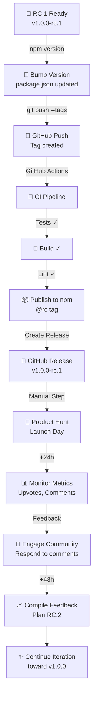

# Release Flow & Timeline

## Complete Launch Flow



## Timeline

### Phase 1: Pre-Launch (T-3 to T-1)
```
T-3 days: Prepare screenshots, demo video, blog post
T-2 days: Review all documentation, test builds
T-1 days: Schedule social media, prepare PH submission
T-0 days: Final checks, ready button
```

### Phase 2: Release Day (T-0)
```
T-0 00:00 GMT: Run: npm version prerelease --preid=rc
T-0 00:01 GMT: git push origin main --tags
T-0 00:02 GMT: Monitor GitHub Actions
T-0 00:10 GMT: Verify npm publication
T-0 12:01 AM PT: LAUNCH on Product Hunt! 🚀
```

### Phase 3: Launch Day Engagement (T+0 to T+24h)
```
T+0 (12:01 AM PT):   🎯 Submit to Product Hunt
T+1h:                📱 Share on Twitter
T+2h:                💬 Respond to first comments
T+6h:                📊 Check metrics (aim for top 5)
T+12h:               🌙 Sleep (but keep monitoring)
T+24h:               📈 Day 1 wrap-up, prepare Day 2 content
```

### Phase 4: Week 1 (T+1 to T+7 days)
```
T+24h (Day 2):       📖 Publish Dev.to article
T+48h (Day 3):       🎉 Celebrate milestones (100 upvotes, etc)
T+72h (Day 4):       📋 Compile feedback, create GitHub issues
T+168h (Day 7):      🔄 Plan RC.2 improvements
```

## Success Metrics

### Day 1 Targets
- 🏆 **Product Hunt**: 300-500 upvotes
- ⭐ **GitHub Stars**: 100+
- 📦 **npm Installs**: 200+

### Week 1 Targets  
- 🏆 **Product Hunt**: 500-1000 upvotes (or top 5 for week)
- ⭐ **GitHub Stars**: 300-500
- 📦 **npm Installs**: 1000+
- 💬 **Comments/Issues**: 20+

### Month 1 Targets
- ⭐ **GitHub Stars**: 500-1000
- 📦 **npm Installs**: 5000+
- 🍴 **Forks**: 30+
- 🐛 **Issues/PRs**: Healthy community activity

## Release Artifacts

### What Gets Published

#### npm
```
mcp-gen@1.0.0-rc.1
├── Dist files
├── package.json
├── README.md
└── License
```

Tag: `@rc` (installed via `npm install mcp-gen@rc`)

#### GitHub Release
```
v1.0.0-rc.1
├── Release Notes
├── Assets (if any)
└── Auto-generated changelog
```

#### Documentation
```
Committed to main:
├── CHANGELOG.md       (What's in RC.1)
├── RELEASE_STRATEGY.md (How releases work)
├── PRODUCT_HUNT.md    (PH positioning)
├── LAUNCH_CHECKLIST.md (Full checklist)
└── README.md/pt-BR.md (Updated status)
```

## Dependency Chain

```
1️⃣ Local Changes
   ↓
2️⃣ Git Tag Push
   ↓
3️⃣ GitHub Actions Triggered
   ↓
4️⃣ Tests Pass ✅
   ↓
5️⃣ npm Publish
   ↓
6️⃣ GitHub Release Created
   ↓
7️⃣ Public Availability
   ↓
8️⃣ Manual: Product Hunt Launch
   ↓
9️⃣ Community Engagement
```

## Communication Timeline

### Pre-Launch (24h before)
- [ ] Notify core team/collaborators
- [ ] Schedule tweets
- [ ] Prepare email/Discord messages

### Launch (T+0)
- [ ] Product Hunt submission
- [ ] Twitter announcement
- [ ] Discord/Slack notification
- [ ] Dev.to draft (publish at T+24h)

### T+1 to T+7
- [ ] Respond to comments (2-4 times daily)
- [ ] Dev.to article publish (T+24h)
- [ ] Update social media with milestones
- [ ] Share feedback compilation (T+72h)

### T+8 to T+30
- [ ] Blog post (if applicable)
- [ ] RC.2 planning/communication
- [ ] Continued community engagement
- [ ] Feature request discussion

## Emergency Procedures

### Critical Bug Found (Post-Launch)
```
1. Create hotfix branch
2. Fix and test locally
3. Publish RC.2 immediately
4. Post update on Product Hunt
5. Notify Twitter followers
```

### Not Hitting Metrics
```
1. Don't panic - RC feedback is more valuable
2. Analyze feedback quality over upvote quantity
3. Plan improvements for RC.2
4. Share learnings with community
5. Build momentum for v1.0.0
```

### Negative Feedback
```
1. Read and understand concerns
2. Respond constructively
3. Acknowledge valid issues
4. Plan fixes transparently
5. Thank critics for feedback
```

## Next Steps After RC.1

### RC.2 (1-2 weeks later)
- Incorporate critical feedback
- Fix reported bugs
- Improve documentation
- Expand plugin system

### RC.3+ (as needed)
- Polish and refinement
- Performance improvements
- Community-driven features

### v1.0.0 Final (3-4 weeks)
- Full stability
- Complete documentation
- Production-ready badge
- Major celebration 🎉

---

## Quick Reference

| Item | Status | Link |
|------|--------|------|
| Version | 2.0.0 | [GitHub](https://github.com/ChristopherDond/MCP-Generator/releases/tag/v2.0.0) |
| npm | @latest | `npm install mcp-gen` |
| Docs | Complete | [README.md](./README.md) |
| PH Guide | Ready | [PRODUCT_HUNT_GUIDE.md](./PRODUCT_HUNT_GUIDE.md) |
| Checklist | Ready | [LAUNCH_CHECKLIST.md](./LAUNCH_CHECKLIST.md) |
| Changelog | Ready | [CHANGELOG.md](./CHANGELOG.md) |

---

Good luck with the launch! 🚀
